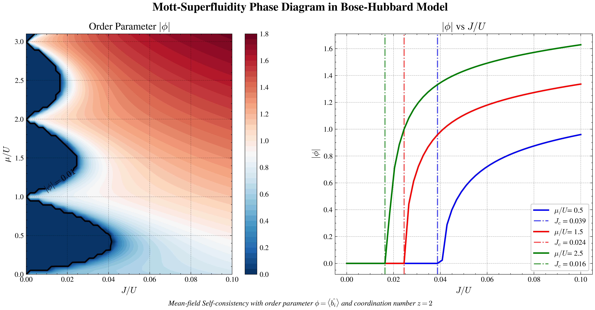

# Mean-field Self-consistent Algorithm for Bose-Hubbard Model: Qualitative Phase Diagram


This project solves the superfluid order parameter of the Bose-Hubbard model via mean-field self-consistent iteration, scans the parameter space of hopping energy $J$ and chemical potential $\mu$, plots the Mott insulator–superfluid phase diagram based on an order-parameter threshold, and analyzes the phase transition behavior at fixed chemical potentials.

---

## Physical Background

The Bose-Hubbard model describes the dynamics of cold bosons in an optical lattice, with Hamiltonian

$$
H = -J \sum_{\langle i,j \rangle} \hat{b}_i^\dagger \hat{b}_j + \frac{U}{2} \sum_i \hat{n}_i (\hat{n}_i - 1) - \mu \sum_i \hat{n}_i,
$$

where $J$ is the nearest-neighbor hopping energy, $U$ is the on-site repulsion, $\mu$ is the chemical potential, $\hat{b}_i$ ($\hat{b}_i^\dagger$) are bosonic annihilation (creation) operators, and $\hat{n}_i = \hat{b}_i^\dagger \hat{b}_i$ is the number operator.

Under the mean-field approximation, set $\hat{b}_i = \phi + \delta \hat{b}_i$ and neglect second-order fluctuations. The many-body problem reduces to a single-site effective Hamiltonian:

$$
H_{\text{MF}} = -z J (\phi^* \hat{b} + \phi \hat{b}^\dagger) + z J |\phi|^2 + \frac{U}{2} \hat{n}(\hat{n}-1) - \mu \hat{n},
$$

where $z$ is the lattice coordination number and $\phi = \langle \hat{b} \rangle$ is the superfluid order parameter. The self-consistency condition is that $\phi$ is given by the ground-state expectation value of this Hamiltonian:

$$
\phi = \langle \psi_0(\phi) | \hat{b} | \psi_0(\phi) \rangle.
$$

Key problems addressed by this code:
1. Construct the matrix $H_{\text{MF}}$ in a truncated Fock space and solve for $\phi$ by self-consistent iteration.
2. Scan the $(J/U, \mu/U)$ parameter plane, compute $|\phi|$ at each point, and use $|\phi| > 0.01$ as the criterion for the superfluid phase, producing a qualitative phase diagram.

---

## Numerical Method

### 1. Basis and Matrix Construction
- Set $N_{\max}=50$, work in the number basis $\{ |n\rangle \} _ {n=0}^{N_{\max}}$ giving a Hamiltonian matrix of dimension $N_{\max}+1$.
- Diagonal elements: $\frac{U}{2} n(n-1) - \mu n - 2 z J |\phi|^2$;
- Off-diagonal elements: $H_{n,n+1} = -2 z J \phi^* \sqrt{n+1}$, $H_{n+1,n} = -2 z J \phi \sqrt{n+1}$.

### 2. Self-consistent Iteration
- Initial guess $\phi_{\text{ini}} = 0.1 + 0.1\mathrm{i}$.
- Loop: given current $\phi_{\text{old}}$, construct $H$ → diagonalize to obtain ground-state wavefunction $\psi$ → compute new order parameter $\phi_{\text{new}} = \langle \psi | \hat{b} | \psi \rangle$.
- Use linear mixing for update: $\phi_{\text{old}} \leftarrow 0.7\phi_{\text{old}} + 0.3\phi_{\text{new}}$ to enhance convergence stability.
- Convergence criterion: $|\phi_{\text{new}} - \phi_{\text{old}}| < 10^{-6}$, or stop after maximum 2000 iterations.

### 3. Parameter Scan and Phase Boundary
- Perform self-consistent iteration pointwise on a grid: $\mu/U \in [0, 3.1]$ (60 points) and $J/U \in [0, 0.1]$ (50 points).
- Record $|\phi|$ at each point and draw a contour plot; the contour $|\phi| = 0.01$ is taken as the qualitative boundary between Mott insulator and superfluid phases.
- Additionally choose three fixed chemical potentials $\mu/U = 0.5, 1.5, 2.5$, plot $|\phi|$ as a function of $J/U$, and mark the critical hopping $J_c$ (the $J$ value at the left of the first point where $|\phi|>0.01$).

---

## Code Structure

- `BH_MF_ycr.ipynb` : main program, including:
  - `buildH(mu, J, phi)`: build the mean-field Hamiltonian matrix;
  - `solveigen(H)`: diagonalize and return the ground-state wavefunction;
  - `getphi(psi)`: compute the order parameter $\phi = \langle \hat{b} \rangle$;
  - `self_consistent(mu, J, phi_ini)`: perform self-consistent iteration and return the converged $\phi$;
  - parameter scanning and data generation;
  - plotting: phase diagram and fixed- $\mu$ cross-section curves.

---

## Dependencies

- Python ≥ 3.7
- `numpy`
- `matplotlib`
- `scienceplots` (optional, for plot styling)

---

## Quick Start

1. **Clone the repository** (or download the files):
   ```bash
   git clone https://github.com/chaoranyang/QuantumManyBody_FromZreo.git
   cd QuantumManyBody_FromZreo/BH_MeanField
2. **Install dependencies:**
   ```bash
   pip install numpy matplotlib SciencePlots
---

## Output Results

- **Phase diagram (left subplot)**: contour plot with $J/U$ on the horizontal axis and $\mu/U$ on the vertical axis; color represents the magnitude of the superfluid order parameter $|\phi|$. The black solid line is the $|\phi|=0.01$ contour, approximating the Mott insulator–superfluid phase boundary.
- **Cross-section curves (right subplot)**: for $\mu/U = 0.5, 1.5, 2.5$, $|\phi|$ as a function of $J/U$, with dashed-dotted lines marking the estimated critical $J_c$.
- **Numerical behavior**: Convergence is slower near integer $\mu/U$ (close to the phase transition), but overall stable; scanning 3000 points takes about 2–3 minutes.

---

## References
- **Hui Zhai**, *Ultracold Atomic Physics*, Cambridge University Press, 2021, 310 pp.
