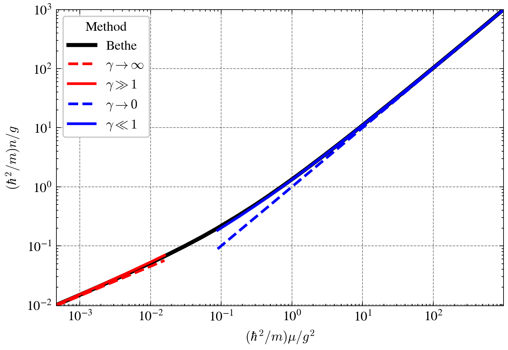

# Solving the equation of state for the one-dimensional Lieb-Liniger model using the Bethe ansatz


This project numerically solves the Bethe ansatz integral equations to compute the ground-state energy and chemical potential of the one-dimensional 
Bose gas described by the Lieb-Liniger model, plots the equation of state curve, and compares it with asymptotic results in the weak- and strong-coupling limits.
---

## Physical background

The uniform one-dimensional Bose gas is described by the Lieb‑Liniger model, whose Hamiltonian is

$$
H = -\frac{\hbar^2 }{2m}\sum_{i=1}^N \frac{\partial^2} {\partial x_i^2} + g \sum_{i < j} \delta(x_i-x_j)
$$

where $g$ is the interaction strength and $m$ is the particle mass. The dimensionless interaction parameter is defined as

$$
\gamma = \frac{mg}{\hbar^2 n},
$$

with $n = N/L$ the particle number density.

In the thermodynamic limit, the ground state can be reduced via the Bethe ansatz to a linear integral equation for the quasi‑momentum distribution $G(q)$:

$$
\alpha = \gamma \int_{-1}^{1} G(q;\gamma) \mathrm{d} q,
$$

$$
G(q;\gamma) = \frac{1}{2\pi} + \int_{-1}^{1} \frac{\mathrm{d}q'}{2\pi} G(q';\gamma) \frac{2\alpha}{(q'-q)^2 + \alpha^2},
$$

where $\alpha(\gamma)$ is a parameter determined by a self‑consistency condition. The ground‑state energy density $e(\gamma)$ is given by

$$
e(\gamma) = \left( \frac{\gamma}{\alpha(\gamma)} \right)^3 \int_{-1}^{1} \mathrm{d}q G(q;\gamma) q^2.
$$

From this, the chemical potential is

$$
\mu = \frac{\hbar^2}{2m} n^2 \bigl[ 3e(\gamma) - \gamma e'(\gamma) \bigr].
$$

The core problems solved by this code are:
1. Self‑consistently determine $\alpha$ and $G(q)$ for a given sequence of $\gamma$ values;
2. Compute $e(\gamma)$ and $\mu(\gamma)$ and plot them, comparing with known asymptotic expressions for strong coupling ($\gamma\to\infty$) and weak coupling ($\gamma\to0$).

---

## Numerical method

### 1. Self‑consistent iterative solution of the Bethe equations

- **Discretisation**: The $q$ domain $[-1,1]$ is uniformly divided into 200 grid points with spacing $\Delta q$.
- **Initial guess**:  
  - For the first $\gamma$ value (the largest $\gamma$), a uniform initial guess $G(q)=1/(2\pi)$ and a large $\alpha=1000$ are used.  
  - For subsequent $\gamma$ values, the converged result from the previous $\gamma$ is used as the initial guess to accelerate convergence.
- **Iterative update**:  
  - Using the current $G$ and $\alpha$, compute the integrand $f(q,q') = \frac{G(q')}{\pi} \frac{\alpha}{(q'-q)^2+\alpha^2}$.  
  - Update $G(q) = \frac{1}{2\pi} + \int dq' f(q,q')$ via the trapezoidal rule.  
  - Update $\alpha = \gamma \int dq\, G(q)$ using the new $G(q)$.  
- **Convergence criterion**: Stop when the sum of squared differences (for $G$) and the absolute difference (for $\alpha$) between two successive iterations are both smaller than $10^{-10}$, or when the maximum number of iterations (default 1000) is reached.

### 2. Computation of ground‑state energy and chemical potential

- The ground‑state energy $e(\gamma)$ is obtained by trapezoidal integration of $G(q) q^2$.
- The derivative $e'(\gamma) = de/d\gamma$ in the chemical potential is computed using **non‑uniform central differences**:
  - For interior points: $f'(x_i) \approx \frac{h_1^2 f_{i+1} + (h_2^2-h_1^2) f_i - h_2^2 f_{i-1}}{h_1 h_2 (h_1+h_2)}$, where $h_1=x_i-x_{i-1}$, $h_2=x_{i+1}-x_i$.
  - Forward/backward differences are used at boundaries.
- The final dimensionless chemical potential is $\tilde\mu = 3e - \gamma e'$. In the plots the coordinates are defined as

$$
x = \frac{\tilde\mu}{2\gamma^2}, \qquad y = \frac{1}{\gamma},
$$

which correspond to the physical quantities $(\hbar^2/m)\mu/g^2$ and $(\hbar^2/m)n/g$, respectively.

### 3. Asymptotic curves

Four theoretical asymptotic lines are plotted on a log‑log scale:

- $\gamma \to \infty$ (strong coupling, fermionisation limit): $n = \sqrt{\frac{2m\mu}{\pi^2\hbar^2}} \quad\Rightarrow\quad y = \sqrt{\frac{2x}{\pi^2}}$,

- $\gamma \gg 1$ (strong coupling, leading + next‑to‑leading order): $n = \sqrt{\frac{2m\mu}{\pi^2\hbar^2}} + \frac{8\mu}{3\pi g} - \frac{2\sqrt{2}\hbar\mu^{1.5}}{\pi^2 g^2\sqrt{m}}$,

- $\gamma \to 0$ (weak coupling, mean‑field limit): $n = \frac{\mu}{g} \quad\Rightarrow\quad y = x$,

- $\gamma \ll 1$ (weak coupling, leading + next‑to‑leading order): $n = \frac{\mu}{g} + \frac{1}{\pi}\sqrt{\frac{m\mu}{\hbar^2}}$.

---

## Code structure

- `BD_mission_ycr.ipynb`: main Jupyter notebook containing  
  - imports (`numpy`, `matplotlib`)  
  - iterative function `bethe(γ, max_iter, ϵ)`: takes an array of $\gamma$ and returns the array of $e(\gamma)$  
  - numerical differentiation function `μ_dimless(γ, e)`: returns dimensionless chemical potential  
  - data generation: calls `bethe` to obtain $e$, computes chemical potential, builds the plotting data `x` and `y`  
  - asymptotic curve generation (labelled `yinfy`, `ybb1`, `y0`, `yss1`)  
  - plotting: uses the `science` style from the `scienceplots` package and outputs a log‑log comparison plot  
- `BECandBethe_Note.ipynb`: basic knowledge and detailed derivations of Bose‑Einstein condensation and the Bethe ansatz  
- `README_md`: brief task description

---

## Dependencies

Running the code requires the following Python libraries:

- `numpy`
- `matplotlib`
- `scienceplots` (only for the plotting style; can be installed via `pip install SciencePlots`)

Python 3.7 or higher is recommended.

---

## Quick start

1. **Clone the repository** (or download the files):
   ```bash
   git clone https://github.com/chaoranyang/QuantumManyBody_FromZero.git
   cd QuantumManyBody_FromZero/LiebLiniger_Bethe
2. **Install dependencies**:
   ```bash
   pip install numpy matplotlib SciencePlots
   
## Results

- **e(γ)  curve**: a linear plot showing the ground‑state energy as a function of the interaction strength.

- **Equation of state comparison (log‑log plot)**:
  - Black solid line: numerical Bethe ansatz result;
  - Red lines: strong‑coupling asymptotics（dashed: $\gamma \to \infty$ ；solid: $\gamma \gg 1$ ）；
  - Blue lines: weak‑coupling asymptotics（dashed： $\gamma \to 0$ ；solid:  $\gamma \ll 1$ ）。

The numerical results agree well with the asymptotic expressions in the small‑ $\gamma$ and large‑ $\gamma$ limits, validating the algorithm.

## References

- **Yao H.P., Guo Y.L. Cold Atom Physics and Low‑Dimensional Quantum Gases. Beijing: Science Press, 2024.**
- **Yang W.L., et al. Integrable Model Methods and Their Applications. Beijing: Science Press, 2019.**
